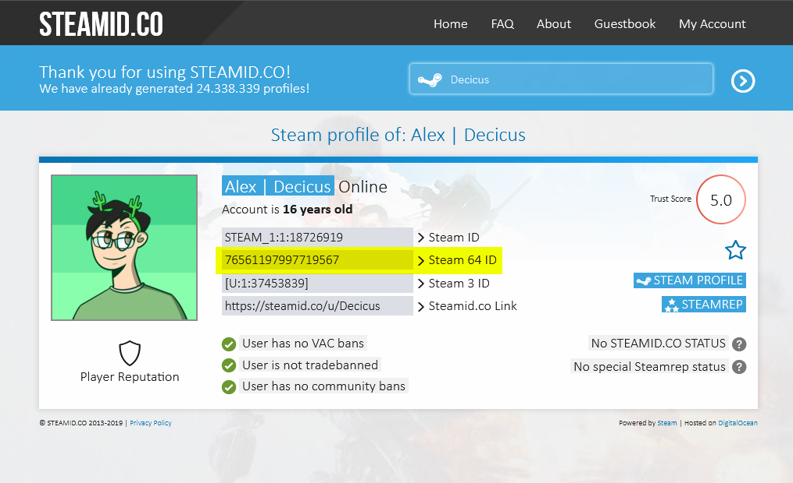
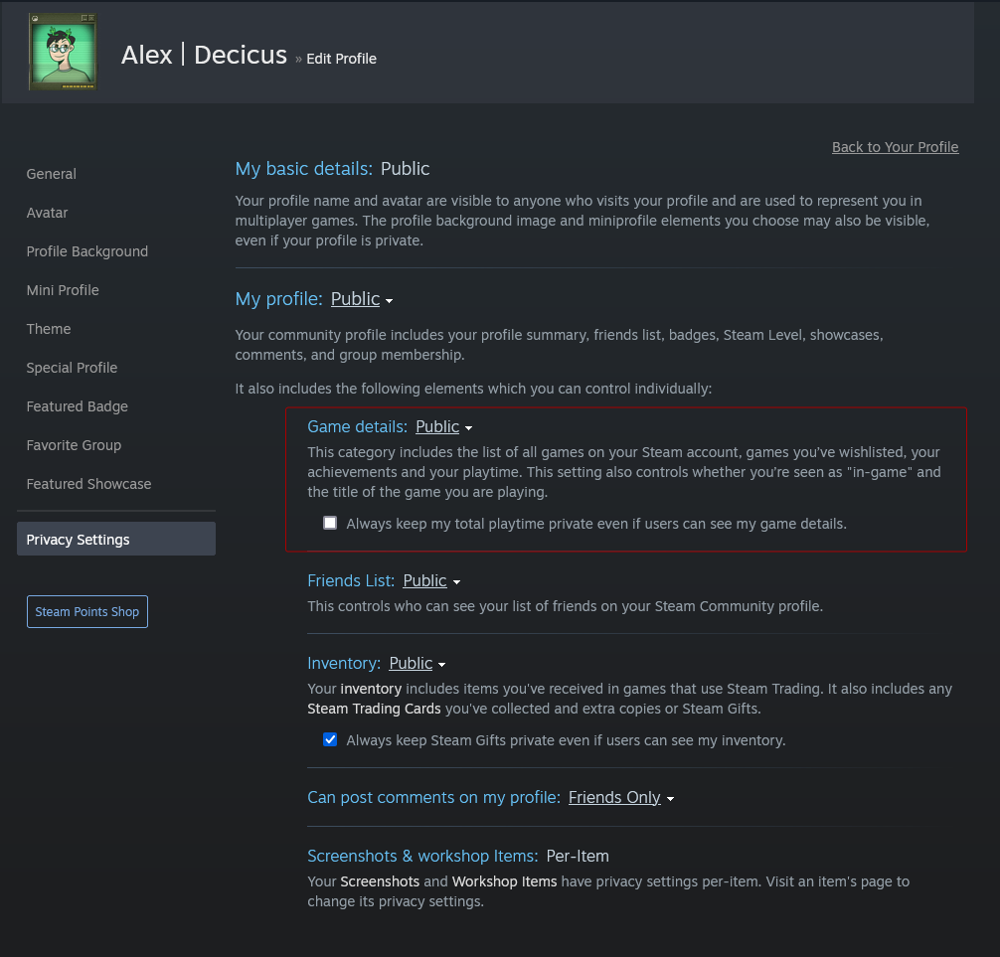

# Player's playtime in a specific Steam game

Returns the specified player's playtime in a specific Steam game.  
You need to know the "Steam 64 ID" of the player you want to get the playtime for, as well as the app ID of the game.

For the "Steam 64 ID", you can use a service like [SteamID.co](https://steamid.co/) and put your Steam community profile URL in to get the ID.  
For example, the Steam 64 ID for the profile URL `https://steamcommunity.com/id/Decicus/` is `76561197997719567`.  

The "app ID" of a Steam game can be found in the URL of the game's store page.  
For example:

- Counter-Strike 2 has the app ID `730`: [https://store.steampowered.com/app/730/CounterStrike_2/](https://store.steampowered.com/app/730/CounterStrike_2/)
- DayZ has the app ID `221100`: [https://store.steampowered.com/app/221100/DayZ/](https://store.steampowered.com/app/221100/DayZ/)
- Half-Life 2 has the app ID `220`: [https://store.steampowered.com/app/220/HalfLife_2/](https://store.steampowered.com/app/220/HalfLife_2/)

!!! note
    Game details, such as hours played, is by default hidden.  
    If you want to show your game details, you can change your Steam "Game Details" to public in the privacy settings.  
    You can find the privacy settings by [clicking here](https://steamcommunity.com/my/edit/settings).  
    

## Endpoint URL

`{{ base_url }}/steam/hours/YOUR_STEAMID_HERE/GAME_APPID_HERE`

See [example](#example) below for usage with an actual Steam game and profile.

## URL parameters

- `steamid` - **Required** - The Steam 64 ID of the player to get the playtime for.
- `appid` - **Required** - The Steam AppID of the game to get the player count for.
- `readable` - **Optional** - If specified, the playtime will be returned in a more human-readable format.
    - For instance - Instead of `36 hours`, it will return `1 day, 12 hours`.
    - This is simply added at the end of the URL as literally `/readable`, see examples below for usage.

## Query parameters

- `round` - **Optional** - Round the playtime to the specified number of decimal places.
    - If specified with 0 or below, or with no value, the result will be rounded to the nearest whole number.
    - This is not compatible with the `readable` parameter.
- `format` - **Optional** - Allows you to customize the output format.
    - Default is: `%s hours`
    - If you wish to only get the number of hours, you can specify `format=%s` in the query parameters. See examples below for usage.
    - Not compatible with the `readable` URL parameter.
- `key` - **Optional** - Your Steam API key.  
    - This is required if you want to get the hours from a private Steam profile.
    - If you don't have a Steam API key, you can get one [here](https://steamcommunity.com/dev/apikey).
        - If you need a "domain name" for the API key, you can use `example.com`.
    -   !!! warning
        **Note**: Please make sure to keep your Steam API key private. If you plan on using it in a bot command, I suggest adding the command via the bot's dashboard instead of directly in chat.

## Example

- My total hours in Half-Life 2: [{{ base_url }}/steam/hours/76561197997719567/220]({{ base_url }}/steam/hours/76561197997719567/220)
    - `76561197997719567` is my Steam 64 ID, and `220` is the app ID for Half-Life 2.
- My total hours in DayZ, with the "readable" format: [{{ base_url }}/steam/hours/76561197997719567/221100/readable]({{ base_url }}/steam/hours/76561197997719567/221100/readable)
    - `76561197997719567` is my Steam 64 ID, and `221100` is the app ID for DayZ. `/readable` is specified as-is at the end of the URL.
- My total hours in Garry's Mod, with just the number of hours, no trailing text: [{{ base_url }}/steam/hours/76561197997719567/4000?format=%s]({{ base_url }}/steam/hours/76561197997719567/4000?format=%s)
    - `76561197997719567` is my Steam 64 ID, and `4000` is the app ID for Garry's Mod.
- My total hours in Grand Theft Auto V, with custom text. `+` (plus sign) in the URL is used to represent spaces.: [{{ base_url }}/steam/hours/76561197997719567/271590?format=Alex+has+been+playing+GTAV+for+%s+hours]({{ base_url }}/steam/hours/76561197997719567/271590?format=Alex+has+been+playing+GTAV+for+%s+hours)
    - `76561197997719567` is my Steam 64 ID, and `4000` is the app ID for Half-Life 2.
