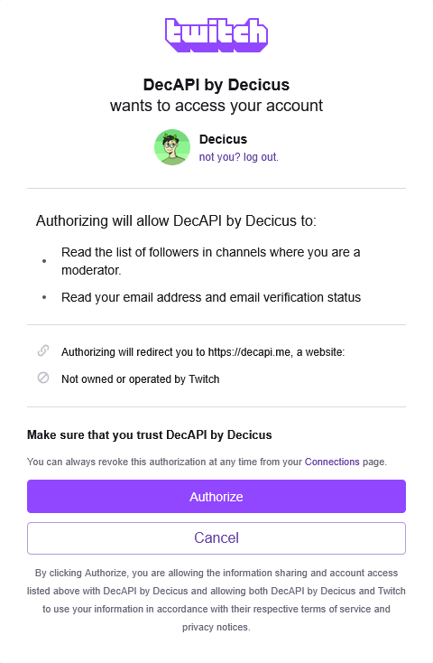
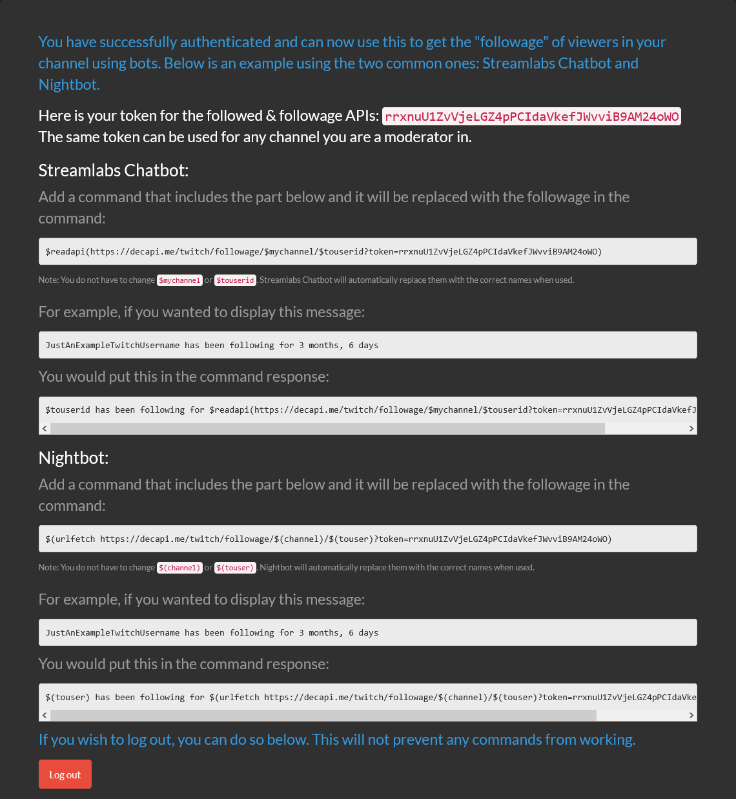

# Follow age - how long a Twitch user has been following a channel

Gives you the duration of how long a Twitch user has been following a specified channel.

## Endpoint URL

`{{ base_url }}/twitch/followage/CHANNEL_USERNAME_HERE/USER_USERNAME_HERE?token=YOUR_DECAPI_TOKEN_HERE`

See [examples](#examples) below for usage with an actual Twitch channel and username.

## Token requirement

The `token` query parameter is required. This needs to belong to either the Twitch channel owner, or a chat moderator of the channel.  
VIPs and regular viewers cannot use their token with this endpoint due to Twitch API restrictions. There is nothing DecAPI can do to work around this.

Expand the section below for a step-by-step guide with screenshots on how to get your DecAPI token:

??? info "How to get your DecAPI token for follow age"
    ### Step 1 - Go to the DecAPI Twitch authentication URL for follow age

    Go to the following URL in your web browser: [`{{ base_url }}/auth/twitch?redirect=followage&scopes=moderator:read:followers`]({{ base_url }}/auth/twitch?redirect=followage&scopes=moderator:read:followers)

    If you're already logged into your Twitch account, it should look something like this:

    ??? example "Click here to see screenshot"
        

    Click on authorize to continue.

    ### Step 2 - Getting your token

    After authorizing DecAPI, you will be redirected to a page that shows your DecAPI token. It should look something like this:

    ??? example "Click here to see screenshot"
        

    Copy the token shown on the page, in my example it's `rrxnuU1ZvVjeLGZ4pPCIdaVkefJWvviB9AM24oWO`, but **this will be different for you and every other user**.

    ### Step 3 - Using your token with the follow age endpoint

    Now that you have your DecAPI token, you can use it with the follow age endpoint.
    Replace the `YOUR_DECAPI_TOKEN_HERE` part of the URL with your actual token.
    
    If you're using this with a known chatbot, check out the [examples for bots below](#examples-for-bots) and <ins>ONLY</ins> replace the `YOUR_DECAPI_TOKEN_HERE` part.  
    You can leave the other parts in the examples as they are, they will be automatically converted by your bot when you use the command.

## Required URL parameters

- `channel` - **Required** - Twitch channel to check the follow age on.
- `user` - **Required** - Twitch username to check the follow age for.

## Query parameters

- `token` - **Required** - Your DecAPI token. If you don't already have one, get it via [this DecAPI URL]({{ base_url }}/auth/twitch?redirect=followage&scopes=moderator:read:followers).
- `precision` - Optional - The "precision" of the follow age. Essentially the maximum amount of time units to show. Default is `2`.
    - Example: If the follow age is "1 year, 2 months, 3 days, 4 hours, 5 minutes, 6 seconds" and you set precision to `3`, the result will be "1 year, 2 months, 3 days".
    - Valid values are:
        - `1` - Show only the largest time unit (e.g., "2 years")
        - `2` - Show the two largest time units (e.g., "2 years, 3 months"). This is the default.
        - `3` - Show the three largest time units (e.g., "2 years, 3 months, 2 weeks")
        - `4` - Show the four largest time units (e.g., "2 years, 3 months, 2 weeks, 4 days")
        - `5` - Show the five largest time units (e.g., "2 years, 3 months, 2 weeks, 4 days, 5 hours")
        - `6` - Show all time units except seconds (e.g., "2 years, 3 months, 2 weeks, 4 days, 5 hours, 6 minutes")
        - `7` - Show all time units including seconds (e.g., "2 years, 3 months, 2 weeks, 4 days, 5 hours, 6 minutes, 7 seconds")
- `lang` - Optional - Language to use for the output. Default is `en` (English).
    - See the [homepage](../index.md#localization-translations) for more information about the currently supported languages.

## Examples

- How long ago Halifax followed Decicus, default precision with default language (English): [{{ base_url }}/twitch/followage/decicus/halifax]({{ base_url }}/twitch/followage/decicus/halifax?token=YOUR_DECAPI_TOKEN_HERE)
- How long ago Halifax followed Decicus, with maximum precision (7) and default language (English): [{{ base_url }}/twitch/followage/decicus/halifax?token=YOUR_DECAPI_TOKEN_HERE&precision=7]({{ base_url }}/twitch/followage/decicus/halifax?token=YOUR_DECAPI_TOKEN_HERE&precision=7)
- How long ago Halifax followed Decicus, with maximum precision (7) and translated to German: [{{ base_url }}/twitch/followage/decicus/halifax?token=YOUR_DECAPI_TOKEN_HERE&precision=7&lang=de]({{ base_url }}/twitch/followage/decicus/halifax?token=YOUR_DECAPI_TOKEN_HERE&precision=7&lang=de)