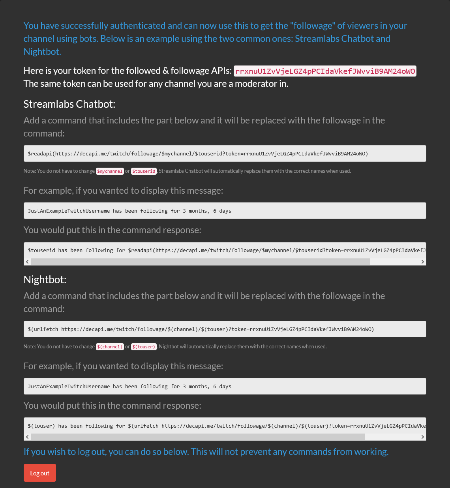

# Followed - when a Twitch user followed a channel

Retrieves the date and time of when a specified user followed a Twitch channel.

## Endpoint URL

`{{ base_url }}/twitch/followed/CHANNEL_USERNAME_HERE/USER_USERNAME_HERE?token=YOUR_DECAPI_TOKEN_HERE`

## Token requirement

The `token` query parameter is required. This needs to belong to either the Twitch channel owner, or a chat moderator of the channel.  
VIPs and regular viewers cannot use their token with this endpoint due to Twitch API restrictions.

Expand the section below for a step-by-step guide with screenshots on how to get your DecAPI token:

??? info "How to get your DecAPI token for followed"
    ### Step 1 - Go to the DecAPI Twitch authentication URL for followed

    Go to the following URL in your web browser: [`{{ base_url }}/auth/twitch?redirect=followed&scopes=moderator:read:followers`]({{ base_url }}/auth/twitch?redirect=followed&scopes=moderator:read:followers)

    If you're already logged into your Twitch account, it should look something like this:

    ??? example "Click here to see screenshot"
        

    Click on authorize to continue.

    ### Step 2 - Getting your token

    After authorizing DecAPI, you will be redirected to a page that shows your DecAPI token. It should look something like this:

    ??? example "Click here to see screenshot"
        

    Copy the token shown on the page — it will be unique.

    ### Step 3 - Using your token with the followed endpoint

    Replace the `YOUR_DECAPI_TOKEN_HERE` part of the URL with your actual token.

## Required URL parameters

- `channel` - **Required** - Twitch channel to check.
- `user` - **Required** - Twitch username to check for when they followed the channel.

## Query parameters

- `token` - **Required** - Your DecAPI token. Get it via [this DecAPI URL]({{ base_url }}/auth/twitch?redirect=followed&scopes=moderator:read:followers).
- `tz` - Optional - Timezone to display the returned date/time in. See <a href="{{ base_url }}/misc/timezones">list of supported timezones</a>.
    - Default: `UTC`
    - Some examples:
        - `America/Los_Angeles` - Pacific Time (US & Canada)
        - `America/New_York` - Eastern Time (US & Canada)
        - `Europe/Berlin` - Central European Time
        - `Asia/Tokyo` - Japan Standard Time
- `format` - Optional - PHP `date()` format string to change the formatting of the returned date & time.
    - Default: `M j. Y - h:i:s A (e)`
        - See the <a href="https://www.php.net/manual/en/datetime.format.php#refsect1-datetime.format-parameters">PHP date() documentation</a> for available format characters.
        - Here's how the default looks like: `Mar 13. 2016 - 07:31:29 PM (UTC)`
    - Example formats:
        - `F jS Y, h:i:s A` &rarr; `October 28th 2025, 08:48:27 PM` (12 hour time with AM/PM)
            - Note the lowercase `h` for 12 hour format. Use uppercase `H` for 24 hour format.
        - `Y-m-d H:i:s` &rarr; `2025-10-28 20:48:27` (24 hour time)
        - `d/m/Y H:i` &rarr; `28/10/2025 20:48` (24 hour time without seconds)

## Examples

- When Halifax followed Decicus, default settings: [{{ base_url }}/twitch/followed/decicus/halifax?token=YOUR_DECAPI_TOKEN_HERE]({{ base_url }}/twitch/followed/decicus/halifax?token=YOUR_DECAPI_TOKEN_HERE)
- When Halifax followed Decicus, using the format `2014-08-24 23:15:14` and setting timezone to Berlin, Germany (Central European Time): [{{ base_url }}/twitch/followed/decicus/halifax?format=Y-m-d H:i:s&tz=Europe%2FBerlin&token=YOUR_DECAPI_TOKEN_HERE]({{ base_url }}/twitch/followed/decicus/halifax?format=Y-m-d H:i:s&tz=Europe%2FBerlin&token=YOUR_DECAPI_TOKEN_HERE)